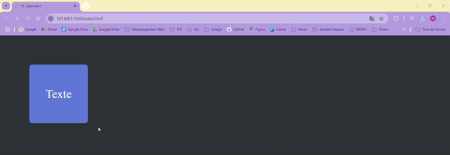

# JavaScript : Exercice I 💻 #
## - Créer une page web affichant un carré (couleur & contenu de votre choix) - ##

 

### Objectifs : ###
***Créer une page web affichant un carré 200 x 200 pixels de la couleur et un contenu texte de votre choix.***

→ En cliquant sur la forme, une boîte de dialogue (alerte) affiche les informations suivantes : 
      <ul><ul>
        <li>Classe CSS de la forme</li>
        <li>Couleur du texte et couleur de fond</li>
        <li>Hauteur et largeur du carré</li>
        <li>Nom de la classe du carré (class : "carre" par exemple)</li>
        <li>Police et taille du texte.</li>
      </ul></ul>
 
### ⚙️ Langages utilisés ⚙️ ###

 

### Preview : ###
</img>

 

*Note : exercice fourni par <a href="https://elan-formation.fr/accueil">Elan Formation</a>*